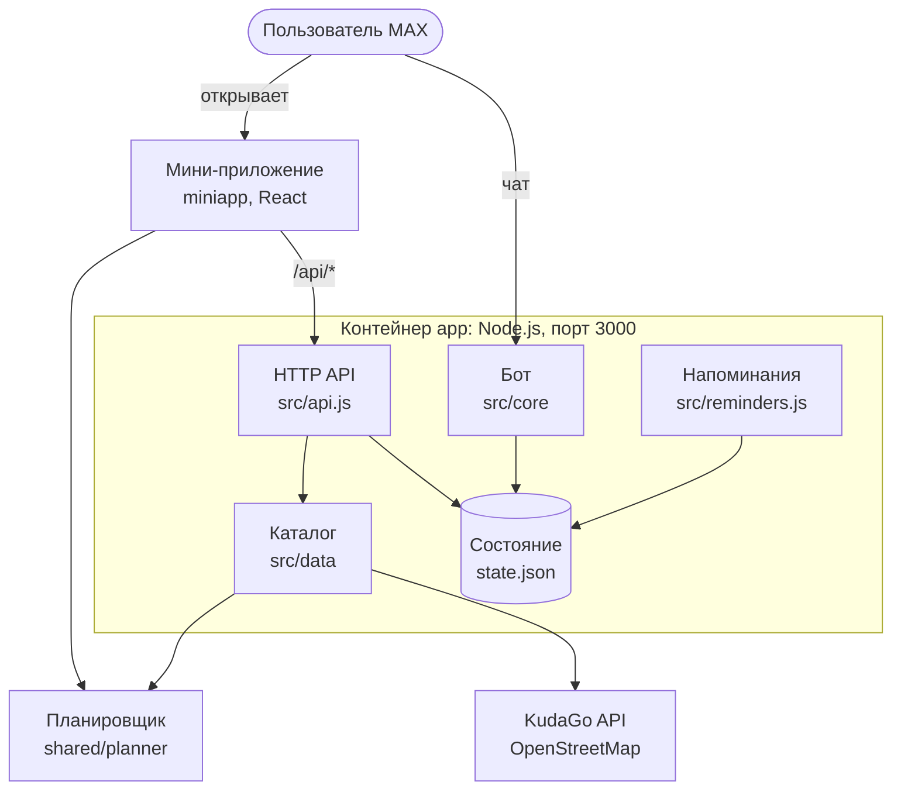
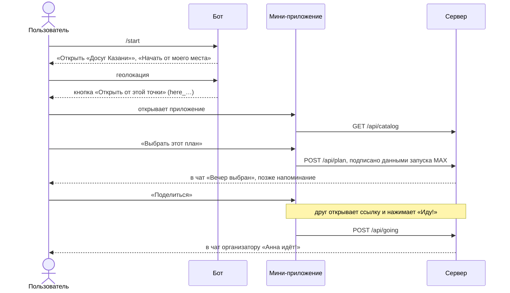

# Досуг Казани — чат-бот и мини-приложение для MAX

Трек «Досуг и развлечения». Мини-приложение собирает вечер под свободное время и точку старта: события,
кафе и спорт Казани с дорогой между ними, картой, такси и приглашением друзей. Чат-бот, к которому оно
подключено, — вход и уведомления: открывает приложение, принимает геолокацию, присылает выбранный план,
напоминание и ответ друга.

- Бот в MAX: [@t441_hakaton_max_bot](https://max.ru/t441_hakaton_max_bot)
- Мини-приложение: https://www.stankincalls.ru (в MAX открывается кнопкой в чате бота)

## 1. Назначение решения

**Пользователь.** Житель или гость Казани 18–25 лет, у которого сегодня вечером или на неделе есть
2–4 свободных часа, часто — с «Пушкинской картой».

**Проблема.** Афиша разбросана по сайтам и соцсетям площадок, цена, время и условия «Пушкинской карты»
указаны по-разному, а несколько мест приходится складывать в один вечер вручную: успеть ли, сколько
ехать, открыто ли. На выбор уходит больше времени, чем на сам вечер.

- Главные причины никуда не выбираться — нехватка времени и усталость (43%) и нехватка денег (30%):
  [ВЦИОМ, 05.05.2025](https://wciom.ru/analytical-reviews/analiticheskii-obzor/dosug-khorosho-no-malo).
- «Пушкинская карта» массовая: больше 13 млн участников на конец 2025 года
  ([«Культура», 29.01.2026](https://portal-kultura.ru/articles/news/375156-chislo-derzhateley-pushkinskoy-karty-na-konets-2025-goda-sostavilo-13-mln-chelovek/)),
  в Татарстане — 384 тыс. держателей и 398 учреждений
  ([Минкультуры РТ, 27.01.2026](https://tetyushy.ru/news/natsproekty/v-tatarstane-cislo-polzovatelei-puskinskoi-kartoi-prevysilo-384-tysiaci)).
- Что это боль именно сегмента 18–25 в Казани — допущение. Его проверяем проблемными интервью: гайд,
  критерии подтверждения и пример анализа на ответах — в [docs/INTERVIEWS.md](docs/INTERVIEWS.md).

**Решение.** Три вопроса — когда свободны, как хочется провести время, есть ли льготы, — и планировщик
предлагает до трёх вариантов вечера, которые помещаются в это окно вместе с дорогой от выбранной точки:
пешком или на такси, с запасом до начала и с учётом часов работы. Вечер можно собрать и самому кнопкой
«+ В план»: если что-то не успевается, приложение объясняет почему и предлагает замену. Готовый план
открывается в Яндекс Картах, такси — в Яндекс Go, друга можно позвать одной ссылкой.

## 2. Основной пользовательский сценарий

1. Пользователь открывает бота и нажимает «Начать». Бот сразу предлагает «Открыть «Досуг Казани»» и
   «Начать от моего места». Отправленная геолокация превращается в кнопку «Открыть от этой точки».
2. В приложении, на вкладке «Для вас», видны точка старта, погода, готовые планы и лента событий.
   Любое событие или кафе кнопкой «+ В план» попадает в «Мой план» на выбранный день.
3. «Собрать»: день, начало, сколько есть времени и бюджет → настроение → льготы → до трёх вариантов
   вечера («Лучший вариант», «Дешевле», «Меньше дороги»).
4. План: шаги по времени, дорога между ними, «Всё складывается · есть N мин запаса», карта маршрута.
   Точку можно добавить, убрать, поменять время на месте.
5. «Выбрать этот план» → в чат приходит «Вечер выбран», за час до начала — напоминание.
6. «Поделиться» → друг открывает ссылку и нажимает «Иду!» → организатор получает в чат «Анна идёт!».
7. «Найти» — карта на весь экран: всё, что идёт в выбранный день, категории, виды спорта, фильтры
   (время, цена, «Пушкинская карта», «открыто сейчас», настроение), маршрут до места.
8. «Планы» — выбранные вечера по дням: изменить, позвать, перенести на другой день, архив.

Сценарий один — вечер под свободное время, от подборки до плана, приглашения и напоминания. Спортивные
объекты и группы секций — расширение того же сценария.

## 3. Состав и архитектура решения

Бот, сервер и раздача мини-приложения работают в одном процессе Node.js и одном контейнере.



Как связаны чат и приложение:



| Каталог | Что внутри |
|---|---|
| `src/core/` | Бот: команды и кнопки (`bot.js`), тексты сообщений (`messages.js`), `/remind_test` |
| `src/api.js`, `src/server.js` | HTTP-сервер: мини-приложение, `/healthz`, `/api/catalog`, `/api/plan`, `/api/going`, `/api/geo` |
| `src/initData.js` | Проверка подписи данных запуска MAX (HMAC-SHA256) |
| `src/transports/` | Клиент MAX Bot API (long polling) и консольный режим без токена |
| `src/data/`, `src/sources/` | Каталог: тестовая афиша, кафе и спорт из OSM, афиша KudaGo, часы работы |
| `src/reminders.js`, `src/state.js`, `src/store.js` | Очередь напоминаний и состояние в JSON-файле |
| `src/metrics.js`, `src/weather.js` | Анонимная воронка для `/stats`, прогноз Open-Meteo |
| `shared/planner/` | Планировщик вечера, общий для сервера и приложения: время, дорога, расписание, подбор, правка плана, ссылки в Яндекс Карты и Go |
| `miniapp/src/` | Мини-приложение на React: экраны (`screens/`), компоненты, состояние (`hooks/`), логика (`lib/`) |
| `data/` | `events.json` — тестовая афиша и места города, `cafes.json` и `sports.json` — выгрузки OpenStreetMap |
| `scripts/` | Выгрузка кафе и спорта из OpenStreetMap (запускается вручную) |
| `test/`, `miniapp/test/` | Автотесты (`node:test`) |

Ключевые решения:

- **Бизнес-логика не знает о MAX.** Бот работает с сообщением `{ text, buttons }`, а в протокол MAX его
  переводит транспорт. Поэтому бот проверяется локально, без токена.
- **Один планировщик.** План кодируется в ссылке (`r1140u1320-101-203-155`), и у организатора, у друга
  и в сообщении бота это один и тот же вечер с тем же временем.
- **Параметр запуска.** Бот открывает приложение с параметром: `here_<широта×1000>_<долгота×1000>` —
  точка из чата, `mine_<план>_<день>` — свой вечер, `plan_…` — приглашение, `going_…` — «Анна идёт!».
- **Подписанные запросы.** `POST /api/*` принимаются только с данными запуска MAX, подпись проверяет
  сервер: подставить чужой идентификатор нельзя.

## 4. Запуск всех локальных компонентов одной командой

```bash
cp .env.example .env   # указать MAX_BOT_TOKEN
docker compose up --build
```

Поднимется контейнер с ботом (long polling к MAX) и мини-приложением на http://localhost:3000.
Проверка: http://localhost:3000/healthz отвечает `ok`. Сборка без кэша — около 15 секунд.

Без токена MAX — бот в консоли:

```bash
docker compose run --rm -e TRANSPORT=console app
```

Сервер `platform-api2.max.ru` использует сертификат удостоверяющего центра Минцифры, которого нет среди
доверенных в Node.js. Поэтому в репозитории лежит публичный корневой сертификат
`certs/russian_trusted_root_ca.pem` (источник: https://gu-st.ru/content/lending/russian_trusted_root_ca_pem.crt).
Он используется только для соединений с MAX API, проверка TLS не отключается.

## 5. Необходимые параметры окружения

- Docker Engine 24+ с Compose v2 (или Docker Desktop), около 1 ГБ памяти и 1 ГБ диска.
- Свободный порт 3000.
- Доступ в интернет к `platform-api2.max.ru` (бот) и `st.max.ru` (скрипт MAX Bridge).
- Без Docker: Node.js 24 LTS (минимум 20.12).

## 6. Переменные окружения

Все переменные — в `.env.example`. Обязательна только `MAX_BOT_TOKEN`, и только для работы в MAX.

| Переменная | По умолчанию | Назначение |
|---|---|---|
| `MAX_BOT_TOKEN` | — | Токен бота. Им же проверяется подпись запуска мини-приложения |
| `VITE_BOT_NAME` | — | Ник бота без «@» для ссылок-приглашений; подставляется при сборке |
| `TRANSPORT` | `max` | `max` — бот в MAX, `console` — локальная проверка в консоли |
| `APP_PORT` | `3000` | Порт мини-приложения на компьютере |
| `DOMAIN` | — | Домен для запуска на сервере (профиль `prod`) |
| `KUDAGO` | включено | `off` — не загружать афишу KudaGo |
| `KUDAGO_LOCATION` | `kzn` | Город KudaGo |
| `DEMO_EVENTS` | включено | `off` — убрать тестовые события и группы секций |
| `REMINDER_LEAD_MINUTES` | `60` | За сколько минут до начала напоминать о выбранном вечере |
| `EVENT_UTC_OFFSET_MIN` | `180` | Часовой пояс города в минутах от UTC |
| `STATE_FILE` | `state/state.json` | Файл состояния (в Docker — том `app_state`) |
| `MAX_CA_FILE` | `certs/…pem` | Корневой сертификат для соединений с MAX |
| `MAX_API_BASE_URL`, `REMINDER_CHECK_SECONDS`, `PORT`, `MINIAPP_DIR` | — | Служебные: адрес MAX API, частота проверки напоминаний, порт и папка приложения внутри контейнера |

## 7. Используемые порты

- **3000** — мини-приложение, `/healthz` и `/api/*`. Открыт только на `127.0.0.1`.
- **80, 443** — Caddy с HTTPS, только при запуске на сервере (`--profile prod`).
- Бот сам подключается к MAX, входящий порт для него не нужен.

## 8. Зависимости

- Сервер и бот — только встроенные модули Node.js, внешних npm-пакетов нет (`package-lock.json`).
- Мини-приложение — React, Leaflet (карты), `@fontsource/inter`, сборка Vite (`miniapp/package-lock.json`).
- Образы Docker с точными версиями: `node:24.21.0-alpine3.24`, `caddy:2.11.4-alpine` (только `prod`).

## 9. Внешние сервисы и интеграции

| Сервис | Зачем | Если недоступен |
|---|---|---|
| MAX Bot API | Сообщения бота, кнопки `open_app` и `request_geo_location`, личные сообщения, меню команд | Бот не отвечает; приложение в браузере работает |
| MAX Bridge | Данные запуска и подпись, «Поделиться», кнопка «Назад», открытие ссылок | Вне MAX — запасные варианты, шаги с отправкой в чат пропускаются |
| KudaGo API | Настоящая афиша Казани, обновление раз в 3 часа | Работает копия с диска |
| OpenStreetMap | Кафе и спорт (выгрузка в `data/`), плитки карты, поиск адреса (Nominatim) | Данные уже в репозитории; без плиток план считается без карты |
| OSRM | Линии маршрута по улицам | Рисуется прямая линия |
| Open-Meteo | Прогноз на часы вечера | Погода не показывается |
| Яндекс Карты, Яндекс Go | Маршрут и такси — только ссылки, без API и ключей | — |
| Let's Encrypt | Сертификат HTTPS на сервере (через Caddy) | — |


**Что нельзя воспроизвести в Docker.** Сам MAX: для проверки бота нужен токен и клиент MAX, для
мини-приложения внутри MAX — публичный HTTPS-адрес, указанный в настройках бота на business.max.ru.
Рабочая версия уже развёрнута: https://www.stankincalls.ru.

## 10. Описание работы с данными

- **Каталог.** Сервер собирает его из трёх источников: тестовая афиша `data/events.json` (29 событий и
  13 мест города), OpenStreetMap (400 кафе и баров, 86 спортивных объектов, 48 тестовых групп секций)
  и KudaGo. Мини-приложение получает каталог целиком (`GET /api/catalog`) и считает планы у себя,
  сервер проверяет выбранный план тем же планировщиком. Файлы данных проверяются при запуске.
- **Часы работы** из текстов KudaGo и OpenStreetMap разбираются в расписание по дням: место
  предлагается только тогда, когда оно открыто.
- **Состояние** (`state/state.json`): идентификаторы пользователей MAX, приглашения на 14 дней,
  очередь напоминаний, позиция long polling. Запись атомарная, файл лежит в томе Docker.
- **Персональные данные.** Бот хранит только идентификатор пользователя, приглашения и напоминания.
  Имя используется лишь в тексте «Анна идёт!». Геолокация из чата не сохраняется — она остаётся только
  в кнопке запуска (с точностью около 100 м). Настройки и планы в приложении лежат на устройстве
  (`localStorage`). Всё, что хранит бот, стирается командой `/delete`.
- **Метрики.** Анонимные счётчики по дням: открыли бота, открыли приложение, прислали геолокацию,
  выбрали план, «Иду!». Без идентификаторов, хранятся 60 дней, сводка — `/stats`.
- **Безопасность.** Токен только в `.env`. Подпись данных запуска проверяется (HMAC-SHA256, срок —
  час). «Иду!» принимается только по приглашению, которое организатор создал сам. На `/api/*` — до
  20 запросов в минуту на пользователя, тело запроса до 8 КБ.

## 11. Порядок работы с тестовыми данными

| Данные | Откуда | Как помечено |
|---|---|---|
| Выставки, экскурсии, спектакли | KudaGo | «Данные о событии — KudaGo» |
| Кафе, бары, катки, бассейны, фитнес | OpenStreetMap | «© участники OpenStreetMap», цена — оценка |
| Места города (Кремль, набережные, парки) | `data/events.json`, координаты приблизительные | Источник внизу экрана |
| Концерты, стендап, кино, мастер-классы | `data/events.json`, **вымышлены** | «Тестовое событие: программа и цена вымышлены» |
| Группы фигурного катания и плавания | `data/sports.json`, **вымышлены**, площадки настоящие | «Тестовая группа» |


## 12. Пошаговый сценарий проверки

**В MAX** (бот [@t441_hakaton_max_bot](https://max.ru/t441_hakaton_max_bot)):

1. «Начать» → приветствие и кнопки «Открыть «Досуг Казани»» и «Начать от моего места».
2. «Начать от моего места» → отправить геолокацию → «Открыть от этой точки»: приложение откроется,
   вверху будет «Точка из чата».
3. «Для вас» → готовый план → «Посмотреть план»: шаги, дорога, «Всё складывается».
4. В ленте «+ В план» у события и у кафе → внизу «Мой план · 2 точки». Добавить событие, которое
   пересекается по времени, → «Не успеете» с причиной и заменой.
5. «Найти» → «Спорт» → «Фигурное катание» → метка → карточка группы → кнопка маршрута.
6. «Собрать» → три вопроса → варианты вечера → «Выбрать этот план» → в чате «Вечер выбран».
7. В чате `/remind_test` → через минуту придёт копия напоминания о выбранном вечере.
8. «Поделиться» → второй аккаунт открывает ссылку → «Иду!» → у организатора «… идёт!».
9. Точка старта вверху → «Где я сейчас». Если телефон не отдал геолокацию — «Отправить геолокацию в
   чат» → в чате появится кнопка отправки.
10. `/delete` → «Да, удалить» — данные бота стёрты.

## 13. Примеры ожидаемого поведения системы

- `/start` или любой текст → приглашение открыть приложение; кнопки старых сообщений не ломают диалог.
- Геолокация из Москвы → «Похоже, ты сейчас не в городе Казань — до него около 717 км» и запуск без точки.
- «Где я сейчас»: доступ запрещён → «Доступ к геолокации запрещён…»; нет ответа 12 секунд →
  «Телефон не ответил вовремя…»; вне Казани → «Вы сейчас не в городе Казань…».
- «Когда вы свободны?» в 18:30 → «Сейчас» подписано «с 18:35», все варианты — в окне 18:35–21:35.
- В 23:50 ничего не помещается → «Рядом ничего не подошло» и кнопки «Добавить 30 мин», «Посмотреть на завтра».
- Пересечение по времени → «Не успеете»: «В плане уже есть … — время пересекается», похожее, что
  встаёт, и «Заменить».
- «+ В план» у уже начавшегося события → «Это уже началось — сегодня не успеть».
- Событие на завтра из «Найти» → отдельный «Мой план · завтра».
- Карточка кафе → часы работы, «Средний чек ≈ 350 р» и пометка «средний чек — оценка по типу заведения»,
  без блока «Билеты».
- «Выбрать этот план» → «Вечер выбран… Напомню в 18:00 — за 60 мин до начала»; меньше часа до
  начала — за 10 минут; меньше 10 минут — напоминание не ставится.
- Приглашение старше 14 дней → «Приглашение устарело — сообщите организатору сами».
- Приложение открыто больше часа → «Сессия устарела — закройте приложение и откройте его снова».
- Сервер недоступен → «Не получилось загрузить афишу» и «Повторить».
- Перезапуск → напоминания и приглашения на месте, старые события MAX не обрабатываются повторно.

## 14. Известные ограничения

- Дорога — оценка по расстоянию (по прямой × 1,3; пешком 5 км/ч, такси 24 км/ч + 6 минут подачи), без
  пробок. Точный маршрут — в Яндекс Картах.
- Часть событий и все группы секций — тестовые (помечены): KudaGo по Казани отдаёт в основном выставки
  и экскурсии, открытого расписания секций нет.
- Средний чек кафе и цена разового посещения спорта — оценка по типу места.
- Long polling предназначен для разработки; для пилота нужен webhook — меняется только транспорт.
- Состояние в одном JSON-файле: один экземпляр сервера.
- Метрики считают действия, а не уникальных пользователей.
- Один город на развёртывание; выбора города в приложении нет.
- Мини-приложение подключается к боту вручную в настройках бота на business.max.ru.

## 15. Остановка и повторный запуск

```bash
docker compose down        # остановить; состояние остаётся в томе app_state
docker compose up --build  # запустить заново — напоминания и приглашения на месте
docker compose down -v     # остановить и стереть состояние
docker compose logs -f app # журнал: «MAX transport: подключён как …»
```

**На сервере с доменом.** A-запись домена на IP сервера, открытые порты 80 и 443, в `.env` —
`MAX_BOT_TOKEN`, `DOMAIN`, `VITE_BOT_NAME`. Запуск: `docker compose --profile prod up -d --build`
(Caddy сам получит сертификат). Затем на business.max.ru в настройках бота указать адрес приложения.
Обновление — `git pull` и та же команда.

## Масштабирование

- **Не меняется:** сценарий, модель события, планировщик и механика напоминаний. Новый источник афиши —
  отдельный модуль в `src/sources/` по образцу `kudago.js`, ядро его не замечает.
- **Адаптируется под город:** источники данных (город KudaGo, границы выгрузок OSM), часовой пояс,
  известные места, региональные льготы, партнёр, отвечающий за актуальность афиши.
- **Порядок:** пилот в Казани с `DEMO_EVENTS=off` → PRO.Культура.РФ и спортивные реестры Минспорта →
  города Татарстана (тот же партнёр — Минкультуры РТ) → другие регионы по той же схеме.
- **Что понадобится:** база данных вместо JSON-файла, webhook вместо long polling, договорённости о
  доступе к данным и политика обработки персональных данных.
